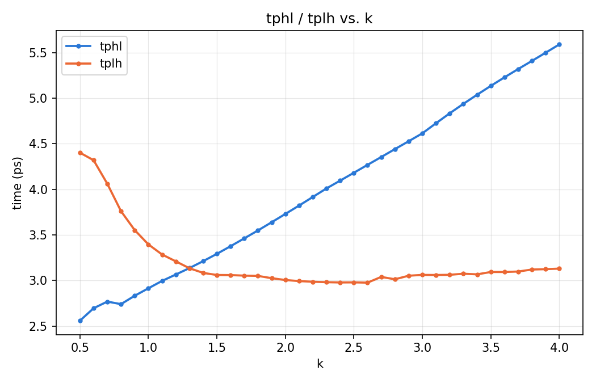
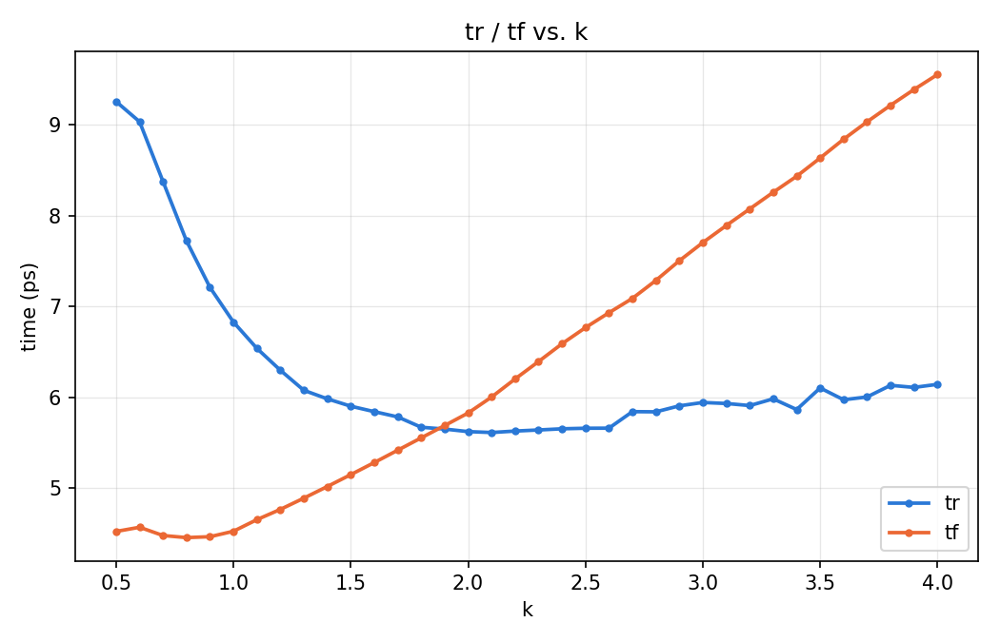

# Inverter Chain K-Sweep Results

Technology: 22nm PTM-HP (BSIM4, level=54), VDD = 0.8 V, WN = 44n (fixed), WP = K·WN.
Deck: `deck_7_inv.sp` (HSPICE), sweeping K from 0.5 to 4.0 in steps of 0.1 (36 points), probing the out2 -> out3 stage of the 7-inverter chain. Source data: `results_10p/results.mt0`; tabulated as `results_10p/k_sweep_results.csv`.

## 1. Propagation delay: tpHL, tpLH

tpHL / tpLH measured at the 0.4 V (50%) logic threshold.

| K | tpHL (ps) | tpLH (ps) |
|---|---|---|
| 0.50 | 2.558 | 4.403 |
| 0.60 | 2.695 | 4.320 |
| 0.70 | 2.768 | 4.062 |
| 0.80 | 2.740 | 3.761 |
| 0.90 | 2.832 | 3.553 |
| 1.00 | 2.914 | 3.396 |
| 1.10 | 2.995 | 3.285 |
| 1.20 | 3.065 | 3.210 |
| 1.30 | 3.136 | 3.134 |
| 1.40 | 3.212 | 3.083 |
| 1.50 | 3.292 | 3.060 |
| 1.60 | 3.376 | 3.059 |
| 1.70 | 3.462 | 3.053 |
| 1.80 | 3.549 | 3.050 |
| 1.90 | 3.639 | 3.025 |
| 2.00 | 3.730 | 3.005 |
| 2.10 | 3.822 | 2.993 |
| 2.20 | 3.916 | 2.986 |
| 2.30 | 4.010 | 2.981 |
| 2.40 | 4.096 | 2.978 |
| 2.50 | 4.182 | 2.979 |
| 2.60 | 4.269 | 2.976 |
| 2.70 | 4.355 | 3.039 |
| 2.80 | 4.442 | 3.013 |
| 2.90 | 4.528 | 3.052 |
| 3.00 | 4.615 | 3.061 |
| 3.10 | 4.726 | 3.060 |
| 3.20 | 4.835 | 3.062 |
| 3.30 | 4.939 | 3.074 |
| 3.40 | 5.039 | 3.067 |
| 3.50 | 5.136 | 3.093 |
| 3.60 | 5.230 | 3.093 |
| 3.70 | 5.321 | 3.098 |
| 3.80 | 5.410 | 3.120 |
| 3.90 | 5.500 | 3.124 |
| 4.00 | 5.591 | 3.130 |

## 2. Rise / fall time: tr, tf

tr / tf measured at out3, 10%-90% (rise) and 90%-10% (fall) of VDD (0.08 V <-> 0.72 V).

| K | tr (ps) | tf (ps) |
|---|---|---|
| 0.50 | 9.259 | 4.522 |
| 0.60 | 9.037 | 4.568 |
| 0.70 | 8.377 | 4.477 |
| 0.80 | 7.723 | 4.454 |
| 0.90 | 7.211 | 4.464 |
| 1.00 | 6.829 | 4.524 |
| 1.10 | 6.539 | 4.652 |
| 1.20 | 6.298 | 4.765 |
| 1.30 | 6.077 | 4.889 |
| 1.40 | 5.983 | 5.017 |
| 1.50 | 5.902 | 5.148 |
| 1.60 | 5.842 | 5.281 |
| 1.70 | 5.784 | 5.417 |
| 1.80 | 5.670 | 5.553 |
| 1.90 | 5.650 | 5.689 |
| 2.00 | 5.622 | 5.827 |
| 2.10 | 5.612 | 6.003 |
| 2.20 | 5.628 | 6.202 |
| 2.30 | 5.640 | 6.394 |
| 2.40 | 5.653 | 6.590 |
| 2.50 | 5.659 | 6.768 |
| 2.60 | 5.660 | 6.932 |
| 2.70 | 5.842 | 7.090 |
| 2.80 | 5.840 | 7.288 |
| 2.90 | 5.906 | 7.505 |
| 3.00 | 5.943 | 7.705 |
| 3.10 | 5.932 | 7.893 |
| 3.20 | 5.909 | 8.076 |
| 3.30 | 5.983 | 8.259 |
| 3.40 | 5.865 | 8.436 |
| 3.50 | 6.103 | 8.637 |
| 3.60 | 5.973 | 8.844 |
| 3.70 | 6.004 | 9.036 |
| 3.80 | 6.132 | 9.218 |
| 3.90 | 6.109 | 9.392 |
| 4.00 | 6.143 | 9.557 |

## 3. tpHL / tpLH vs. K

## 4. tr / tf vs. K

