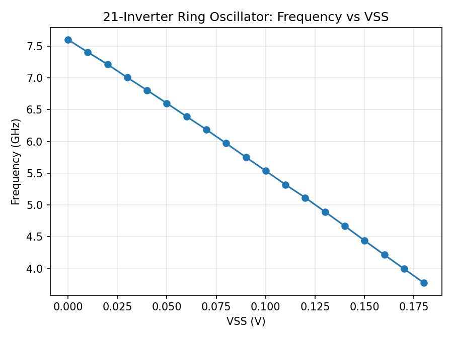
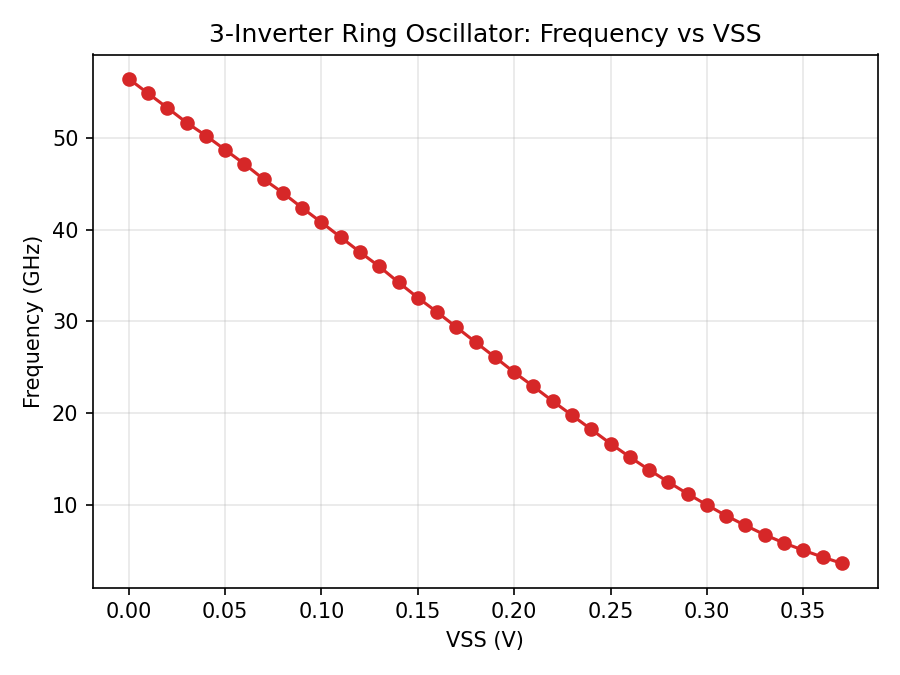

# LAB 2 Ring Oscillator

Technology: 22nm PTM-HP\ 
Nominal VDD = 0.8 V\
k is selected as 1.3 based on Lab1 (K is ratio of PMOS Width to NMOS Width within the inverter subcircuit \
HSPICE simulation for 21 inverter ring oscillator, 3 inverter ring oscillator and 1 inverter ring

## Lab 2.0 
### 
N = 2\*number fo inverters

| Metric              | 21 inverters | 3 inverters |
|---------------------|-------------:|------------:|
| T (period)          | 131.53ps     | 17.71ps     |
| f                    | 7.6GHz       | 56.45GHz    |
| tpHL                | 3.13ps       | 2.851ps     |
| N\*tpHL             | 42\*tpHL = 131.63ps | 6\*tpHL = 17.11ps |
| tpLH                | 3.18ps       | 3.04ps      |
| N\*tpLH             | 42\*tpLH = 133.60ps | 6\*tpLH = 18.24ps |

## Lab 2.25
### Frequency vs. VSS

`gnd_vss` was swept from 0 V to 0.4 V in 10mV steps (VDD held fixed at nominal 0.8 V), reducing the supply headroom seen by the inverters, for both the 21-inverter and 3-inverter rings. Source data: `results_21/results.mt0` (ring.sp) and `results_3/results.mt0` (ring_3.sp).

Frequency drops monotonically as VSS is raised, since tpHL grows much faster than tpLH (e.g. 21-inv: tpHL 3.13ps -> 8.73ps, tpLH roughly flat ~3.2-3.7ps over VSS = 0-0.18V) — raising VSS reduces the NMOS gate-source overdrive (Vgsn = VDD-VSS), slowing the pull-down path while the PMOS pull-up path (source still referenced to VDD) is largely unaffected. \
Oscillation collapses once VSS eats too far into the supply headroom: the 21-inverter ring stops oscillating beyond VSS ~= 0.18-0.19V, while the 3-inverter ring keeps oscillating out to VSS ~= 0.37V before failing — the shorter ring's larger per-stage overdrive margin (fewer stacked delay stages needed to sustain the loop) lets it tolerate a smaller VDD-VSS swing.

