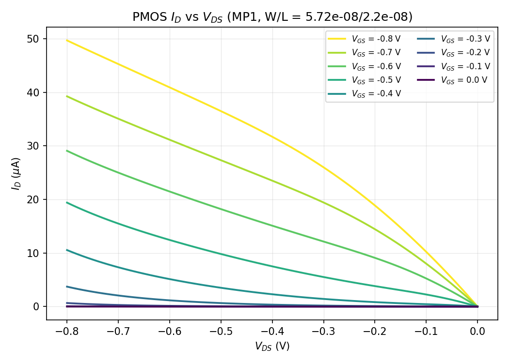
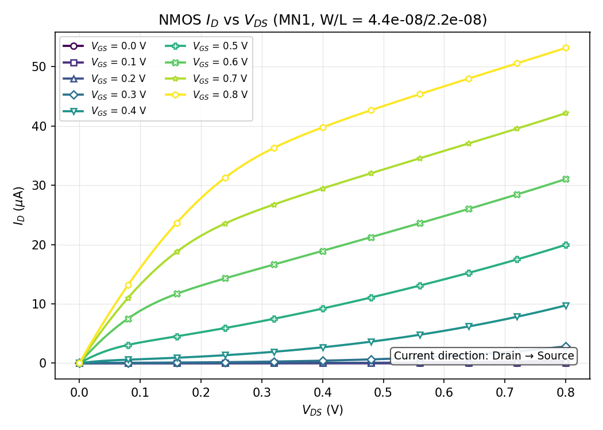

# LAB 3 MOSFET I-V Characteristics

Technology: 22nm PTM-HP\
Nominal VDD = 0.8 V\
k = 1.3 (Wp/Wn), Wn = 44nm, Wp = k\*Wn (from Lab 1)\
Single PMOS (`MP1`) and single NMOS (`MN1`) devices, each characterized separately with `VGATE` and `VDRAIN` sweeping the gate and drain nodes. Plotted current direction is source-to-drain for both devices.

## Lab 3.0
### Drain current vs. VDS, family of curves over VGS

`vdrain` was swept 0 to 0.8 V in 10mV steps (VDS = vdrain - 0.8, so VDS ranges -0.8 V to 0 V), nested inside a `vgate` sweep from 0 to 0.8 V in 100mV steps (VGS = vgate - 0.8, so VGS ranges -0.8 V to 0 V).

Drain current I_D is read from `i(vdrain)` (the VDRAIN source branch current, equal and opposite to `i(vdd)` by KCL).

## Lab 3.1
### NMOS drain current vs. VDS, family of curves over VGS

Same nested sweep as Lab 3.0, but on `MN1` (source/body tied to VSS = 0V), so VDS = vdrain and VGS = vgate directly (both range 0 V to 0.8 V). Drain current I_D is read as `-i(vdrain)` (sign flipped relative to the PMOS case, since the source reference sits at the low rail here instead of VDD, to report a positive I_D that grows with VGS/VDS).

## Appendix: I-V sweep data

Full per-point sweep data (VGS, VDS, ID) for both devices is in CSV form:

- PMOS: [`results_pmos/iv_table.csv`](results_pmos/iv_table.csv)
- NMOS: [`results_nmos/iv_table.csv`](results_nmos/iv_table.csv)
