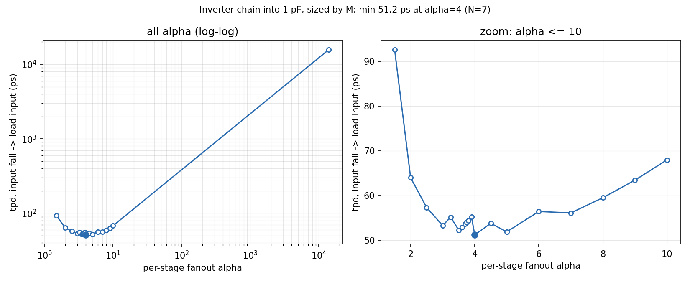
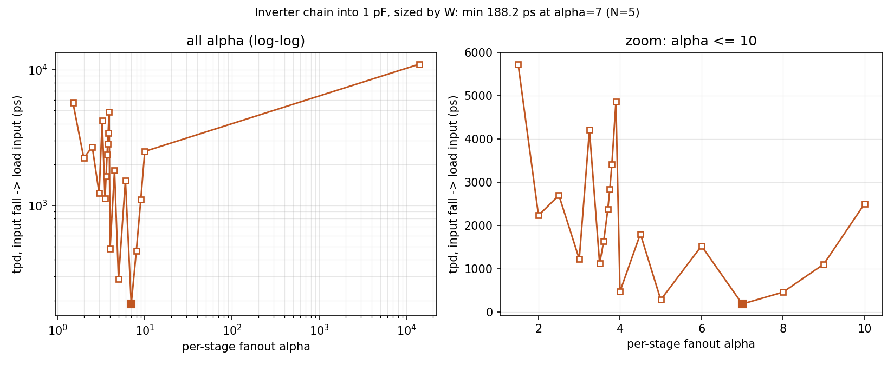

# LAB 5 Gate Sizing

Technology: 22nm PTM-HP\
Nominal VDD = 0.8 V\
k = 1.3 (Wp/Wn), Wn = 44nm, Wp = k\*Wn (from Lab 1)\
Identify how many inverters and what sizes to drive a large capacitance like 1pF or 10pF.\
Answer is a chain of inverters, each inverter $\alpha$ times larger than last inverter.
## Lab 5 Step A
### Modeling load capacitance as an inverter
```
M = C/Cmin
Cmin = capacitance of min sized inverter
Cmin = 71.337 aF 
```
| C (pF) | M |
|:---------:|:-----------------------:|
| 1        | 14018                  |
| 10       | 140180                 |

A load of 1pF is equivalent to an inverter of size ~14000 the min sized inverter.

## Lab 5 Step B
### Plot of delay against $\alpha$

Delay is propagation delay from input of first inverter to input of last inverter (Vdd/2 fall on first inverter to Vdd/2 rise/fall on input of last inverter)





| $\alpha$ | N | tpd, sized by M (ps) | tpd, sized by W (ps) |
|:--------:|:-:|:--------------------:|:--------------------:|
| 1.5 | 24 | 92.67 | 5729 |
| 2 | 14 | 64.01 | 2234 |
| 2.5 | 11 | 57.35 | 2701 |
| 3 | 9 | 53.33 | 1229 |
| 3.25 | 9 | 55.22 | 4208 |
| 3.5 | 8 | 52.31 | 1125 |
| 3.6 | 8 | 52.98 | 1638 |
| 3.7 | 8 | 53.69 | 2371 |
| 3.75 | 8 | 54.06 | 2845 |
| 3.8 | 8 | 54.44 | 3408 |
| 3.9 | 8 | 55.26 | 4861 |
| 4 | 7 | 51.24 | 478.9 |
| 4.5 | 7 | 53.83 | 1808 |
| 5 | 6 | 51.93 | 286.8 |
| 6 | 6 | 56.47 | 1530 |
| 7 | 5 | 56.15 | 188.2 |
| 8 | 5 | 59.55 | 462.4 |
| 9 | 5 | 63.47 | 1108 |
| 10 | 5 | 68.01 | 2502 |
| 14000 | 1 | 15780 | 10970 |
